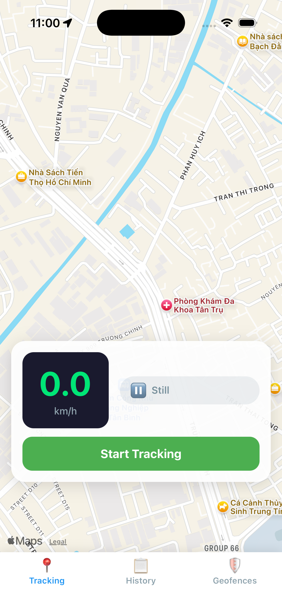
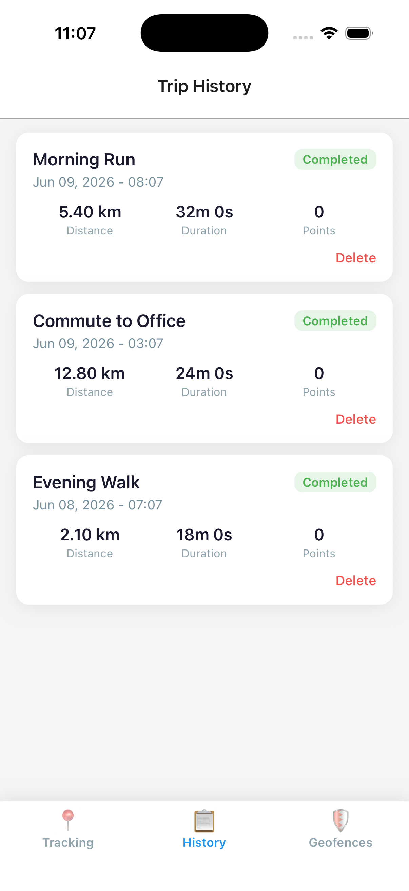
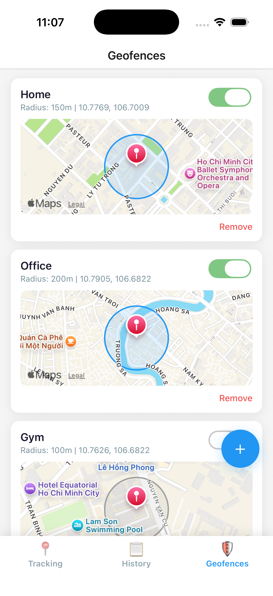
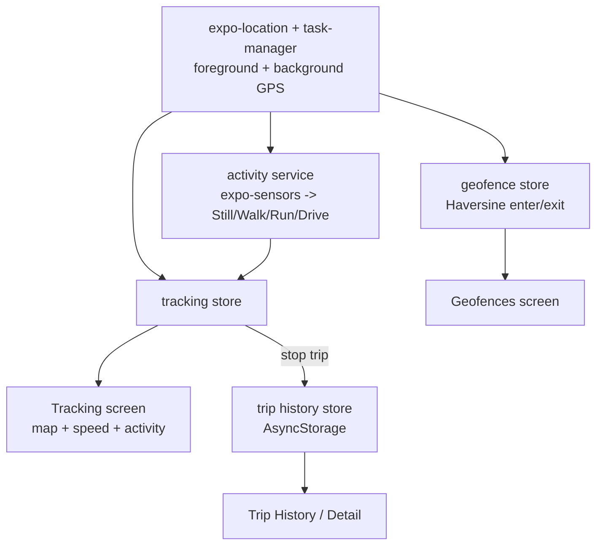

# Expo GPS Trip Tracker

Expo / React Native POC for continuous GPS trip tracking with background location,
automatic trip detection, activity recognition, and geofencing. Built with
TypeScript and Zustand.

## Screenshots

| Tracking | Trip History | Geofences |
| --- | --- | --- |
|  |  |  |

## How it works



## What it shows

- **Live tracking** - real-time speed (km/h), activity badge (Still / Walking /
  Running / Driving) from `expo-sensors`, and the current position drawn on a
  native map (`react-native-maps`, Apple Maps on iOS).
- **Background location** - `expo-location` + `expo-task-manager` keep recording
  trip points when the app is backgrounded (iOS `UIBackgroundModes: location`).
- **Trip history** - completed trips with distance and duration, persisted with
  AsyncStorage; tap a trip for its detail view.
- **Geofencing** - circular zones (Home / Office / Gym) with radius, enter/exit
  detection via the Haversine formula, and per-zone enable toggles.

## Architecture

```
src/
  models/      Trip, LocationPoint, GeofenceZone types
  stores/      Zustand stores (tracking, trip history, geofences)
  services/    gpsService (location + background task), activityService, storageService
  screens/     Tracking, TripHistory, TripDetail, Geofence
  components/   TripCard, SpeedDisplay, ActivityIndicatorBadge
  navigation/  bottom-tab + native-stack navigators
```

- State: **Zustand** stores, one per domain.
- Background work: `expo-task-manager` task defined at module level in `App.tsx`.
- Maps: `react-native-maps` with `PROVIDER_DEFAULT` (Apple Maps on iOS, no API key
  needed on simulator).

## Run

```bash
npm install
npx expo run:ios   # builds a dev client (react-native-maps is a native module)
```

react-native-maps and the background location task are native modules, so this POC
needs a dev build (`expo run:ios` / `expo run:android`), not Expo Go.
